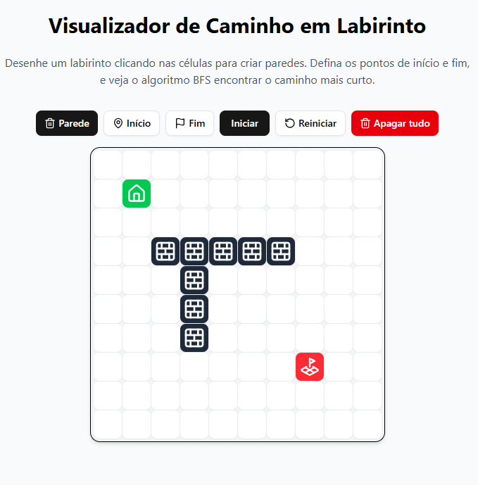

# Caminho Labirinto Com BFS

## Alunos

|Matricula | Aluno|
|-----------|-----|
|Arthur D'Assumpção | 190084570|
|Emerson Teles | 200017322|

## Sobre
Se trata de um jogo, no qual o usuario podera escolher o inicio e o fim do labririnto, além de desenhar paredes nele. Após a configuração do usuario o algoritmo irá rodar uma função BFS que fara a busca do caminho e depois mostrara o melhor caminho a ser escolhido. Tudo de forma visual. A interação visual se parece muito com o funcionamento do Flood Fill, ensinado pelo professor.

## Screenshots

Podemos ver na imagem 1 como o programa esta em estado inicial, na imagem 2 é após configurar o inicio, fim e as paredes do labirinto e na imagem 3 vemos de azul claro todos os nós visitados pela BFS e em amarelo o caminho mais curto entre o inicio e o fim do labirinto.

Imagem 1:

Imagem 2:

Imagem 3:

## Instalação
Não é necessario instalar, fiazemor o deploy do programa, basta acessar: https://labirinto-green.vercel.app/

## Uso
É um jogo educacional que alunos que estudam algoritmos podem ver de forma visual como o BFS percorre o grafo para fazer uma busca.

## Outros
Video: 
